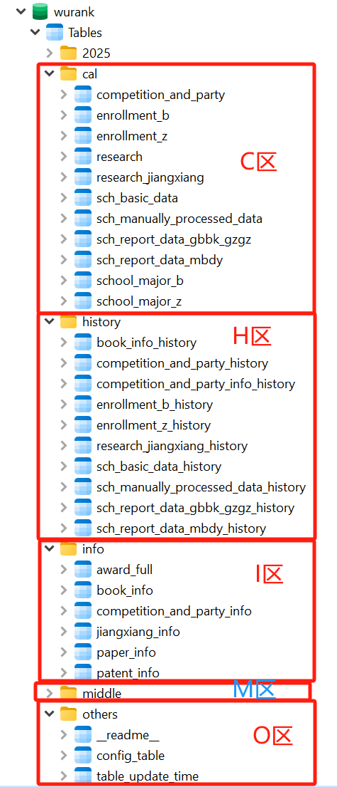

# wurank数据库开发文档

:::tip 小贴士

目前已可局域网访问。暂时无法在公网访问。

:::


## 结构介绍


这里将既有数据分为C、I、M、H、O五个区，赋予不同的功能。

+ `C区`的字段数很精简，参与各种计算。例如，论文、专利、奖项、著作、学生竞赛、党建、艺术作品、就业质量报告数据、院校基本情况等数据需要月度频繁更新，每月大概要向C区更新50-100万条数据。<Badge text="重要"/>

+ `I区`和`C区`数据关联，仅用于向用户展示。例如，出于性能考虑，`C区`只存储论文的学科归属、得分信息，但不存储论文名称、期刊等具体信息。这些基本不参与计算的信息由`I区`存储，可向用户进行展示。

+ `H区`用于局部备份。对于每条数据的改动予以记录，允许版本回退。
:::details 为表格添加局部备份功能代码（基于mysql的trigger实现）
```py
import mysql.connector
from contextlib import closing
import re

# MySQL 连接参数
db_config = {
    'host': '192.168.0.91',
    'user': 'wu',
    'password': 'xZ7FwtAD5HnhajxJ',
    'database': 'wurank',
    'charset': 'utf8mb4'  # 设置字符集
}


# 获取表的列名
def get_columns(cursor, table_name):
    cursor.execute(f"SHOW COLUMNS FROM `{table_name}`")
    return [column[0] for column in cursor.fetchall()]

# 删除历史表（如果存在）
def drop_history_table_if_exists(cursor, conn, table_name):
    history_table = f"{table_name}_history"
    cursor.execute(f"SHOW TABLES LIKE '{history_table}'")
    if cursor.fetchone():
        print(f"History table {history_table} already exists. Dropping it.")
        cursor.execute(f"DROP TABLE IF EXISTS `{history_table}`")
        conn.commit()

# 创建历史表
def create_history_table(cursor, conn, table_name):
    columns = get_columns(cursor, table_name)
    history_table = f"{table_name}_history"
    columns_definition = ', '.join([f"`{col}` VARCHAR(255)" for col in columns])
    history_table_sql = f"""
    CREATE TABLE `{history_table}` (
        {columns_definition},
        `change_at` TIMESTAMP DEFAULT CURRENT_TIMESTAMP,
        `change_type` VARCHAR(10)
    ) CHARACTER SET utf8mb4;
    """
    cursor.execute(history_table_sql)
    conn.commit()
    print(f"History table {history_table} created.")

# 删除表上的所有触发器
def delete_triggers(cursor, conn, table_name):
    cursor.execute(f"SHOW TRIGGERS LIKE '{table_name}';")
    for trigger in cursor.fetchall():
        trigger_name = trigger[0]
        print(f"Deleting trigger: {trigger_name}")
        cursor.execute(f"DROP TRIGGER IF EXISTS `{trigger_name}`;")
    conn.commit()

# 创建触发器 SQL
def create_trigger_sql(table_name, columns, history_table, trigger_type):
    action = {'INSERT': 'NEW', 'UPDATE': 'NEW', 'DELETE': 'OLD'}[trigger_type]
    action_fields = ', '.join([f'{action}.`{col}`' for col in columns])
    
    history_columns = ', '.join([f"`{col}`" for col in columns] + ['change_at', 'change_type'])
    action_values = f"{action_fields}, NOW(), '{trigger_type}'"

    return f"""
    CREATE TRIGGER `{table_name}_{trigger_type.lower()}`
    BEFORE {trigger_type} ON `{table_name}`
    FOR EACH ROW
    BEGIN
        SET @trigger_status = (SELECT status FROM config_table WHERE config_item = '{table_name}_trigger');
        IF @trigger_status = 1 THEN
            INSERT INTO `{history_table}` ({history_columns})
            VALUES ({action_values});
        END IF;
    END;
    """

# 创建所有触发器
def create_triggers(cursor, conn, table_name):
    columns = get_columns(cursor, table_name)
    history_table = f"{table_name}_history"
    
    for trigger_type in ['INSERT', 'UPDATE', 'DELETE']:
        trigger_sql = create_trigger_sql(table_name, columns, history_table, trigger_type)
        cursor.execute(trigger_sql)
    conn.commit()

# 主函数
def update_triggers(table_name):
    try:
        with closing(mysql.connector.connect(**db_config)) as conn, closing(conn.cursor()) as cursor:
            cursor.execute("SET NAMES utf8mb4;")  # 设置会话字符集
            drop_history_table_if_exists(cursor, conn, table_name)
            create_history_table(cursor, conn, table_name)
            delete_triggers(cursor, conn, table_name)
            create_triggers(cursor, conn, table_name)
            print(f"触发器和历史表更新成功: {table_name} 表的触发器和历史表已更新！")
    except mysql.connector.Error as err:
        print(f"出现错误: {err}")

if __name__ == '__main__':
    table_names = ['sch_report_data_gbbk_gzgz']  # 将表名作为参数传入
    for table_name in table_names:
        update_triggers(table_name)
```
:::

+ `M区`是初步计算后得到的数据，用于最终月度排名的计算，以及向用户进行展示。大部分数据预处理逻辑已完成。例如，对500万条论文数据进行计算，得到的按学校-学科分类加总分数，由M区存储，用于下一步计算。

+ `O区`用于部分交互行为。

:::tip long_id的编写说明
对于已有唯一号的，均予以保留。

未统一编号的，所使用的long_id形如B24111903002492。

+ 第1位B（公办）本科/M民办本科/Z高职高专与职业大学，区分公办民办本科和职专（B有时会指公办民办本科，M不单列）。
+ 2-7位填上传日期。
+ 8-9位填上传时的领域，例如有10种不同竞赛，那么这两位可以依次填01-10，只要与本地文件保持一直即可。
+ 10-15填递增序号。
:::

## 各表格“保质期”（暂行）
+ 论文表：1年 ？ 不清楚未来是否完全废弃引用得分。
+ 著作表（需单列）：3个月
+ 专利表：1年
+ 奖项表：永久（直接覆盖式更新）
+ 学生竞赛和党建表：永久（直接覆盖式更新）

过期后处理方法：整表替换，或保留最初一年的资料，其他年份数据全部替换。

:::tip 月度数据更新频次
1. 国内SCD论文检索，已经是月更新的。一直在线服务的。
2. 国际SCDW论文检索，还没上线，打算实现月更新（全库数据准备工作还没搞完，后续可以做到只给月度增量数据，Sqlite格式）
3. 国内SCD图书检索，已经上线，打算实现季度更新（每次都是全库更新，去重动态计算，无法做到增量更新），全库1999-2024的MySQL数据已经交付
4. 国内SCD专利检索，已经上线，打算实现月更新。（后续可以做到只给月度增量数据，Sqlite格式）
:::

## C区表格介绍
### competition_and_party
包含本科、民办、职专的所有党建、思政、各种学生竞赛数据。
为保证入库时结构统一，已按照`【1125定稿】竞赛名与赛道组别对照表.xlsx`重新梳理了所有竞赛的名称。今后入库时应按照最新名称入库。

:::tip 关联表格
此表与`competition_and_party_info` 关联
:::

:::details 字段说明
long_id : 见`结构说明`

category : 根据对照表填写，可选党建、思政、创新创业、数学、数学研、田径、艺术、英语、计算机、职校大赛、艺术展演。其中数学研仅限本科，职校大赛仅限职专。

project_name : 根据对照表填写，第一级项目标题。

sub_project : 第二级项目标题。

sch name : 校名

score : 最终得分

end_year : 由于部分项目的年份信息为一个区间，所以这里取结束年份。

type : 根据陈艺滨的要求暂时保留。目前未使用。
::: 

### enrollment_b
公办、民办本科招生人数数据和本硕博人数折算分。

:::warning 注意
此表仅用于计算本科专业排名，切勿用于计算科研得分。计算科研得分请使用`school_major_b`表
:::

### school_major_b
最终版招生专业情况。先经过了用各种数据对本科生招生数据进行增补调整，又经过了用研究生招生情况进行增补调整。适用于计算科研得分。

### enrollment_z
增补调整后的职专招生人数和开设专业数据。
:::tip 提示
此表可直接用于计算科研得分
:::

### research <Badge text="体积大"/>
论文与专利数据。

:::warning 特别注意
计算本科科研得分时，须使用调整过的最终概率作为probability_all_in_one。此处应当跟子谦确认。
:::

:::tip 关联表格
此表与`patent_info`和`paper_info`关联
:::

:::details 字段说明
long_id : 论文对照号。

date : 日期

sch name : 校名

basic_score : 论文发表基础得分。据此还可以倒推出作者数量和作者顺序。

final_score : 论文最终得分。引用分=final_score - basic_score

probability_all_in_one：本科专业类概率。

from_db : SCD/SCDW/专利

type : 发明专利/实用新型/外观设计

sch_type : 本科/高职高专/民办独院
::: 

### research_jiangxiang
奖项数据。由于奖项在月度更新时，会发生无法追溯和预测的增删改，因此单列。

:::tip 关联表格
此表与`jiangxiang_info`关联
:::

:::details 字段说明
long_id : 由子谦、陈艺滨提供。

type : 国家知识产权局中国专利奖/省级教学成果奖/省级人文社科奖/教育部科学技术奖/教育部人文社科奖/国家级教学成果奖/国家级科学技术奖/省级科学技术奖

其他字段与`research`表相同
::: 

### sch_basic_data
本科、专科的院校基本信息。其中，`sch_id`字段和院校历史变迁有关。

### sch_manually_processed_data
排名需要用到的、处理后的数据。这些数据比较独立，故单独做表存储之。目前包括论文引用胜者、国际论文引用胜者、国内论文引用胜者、标准薪酬、录取分数线。

### sch_report_data_gbbk_gzgz
公办本科和高职高专的《就业质量报告》数据。由于公办和民办大学有的会重叠，所以这两份数据分开存储。对于早前的数据，date统一为发布年年底（如202312）

### sch_report_data_mbdy
民办独院的《就业质量报告》数据。

### school_major_b
最终用于计算科研得分的公办民办本科学校专业开设情况。

### school_major_z
最终用于计算科研得分的职专学校专业开设情况。

## H区表格介绍
H区表格包含其他区表格的全部字段，只是多出change_at、change_type两个字段。change_at为更新时的时间戳，change_type为INSERT/UPDATE/DELETE。
`research类`表格由于体积过大，一般不予备份。

## I区表格介绍
### book_info
著作信息。存储`long_id`和`full_name`字段。

### competition_and_party_info
党建思政和学生竞赛信息。

:::details 字段说明
long_id : 编号，与C区表相匹配。

project_name：参考`【1125定稿】竞赛名与赛道组别对照表.xlsx`。

competition_level：获奖级别，如一等奖、（经费资助）20w、全国党建工作示范高校等等。

original_yr：所采集到的原始年份。有时为区间，如2020-2022。

details: 项目的名称、内容等。

original_org：部分职专院校的原始采集到的名称，根据陈艺滨的要求予以保留。
:::

### jiangxiang_info
奖项信息。存储`long_id`、`项目名称`、`获奖等级`、`完成单位总数`、`完成单位顺序`字段。

:::warning todo_待决策事项
原始采集到的奖项比实际用的奖项多出不少。二者的差主要是那些暂不参与排名的机构（如公司、研究所等）的数据。
未来是否有可能用到这部分数据？是否需要将之存储在此表中？（也就是说，今后jiangxiang_info可能比C区表格条数更多，并且具有完整字段）。

暂时的处理方案是不予存储。
:::

### paper_info
论文信息。

:::tip 作者单位数与顺序
这里未记录作者单位数与顺序。可以根据C区表格的`basic_score`逆推。
:::

:::details 字段说明
long_id：论文对照号。

full_name：论文题目。

journal：期刊。

organAll：原始作者单位。
:::

### patent_info
专利信息。存储字段`long_id`、`full_name`、`unit_order`、`unit_number`

## M区表格介绍
:::tip 建设中...
M区表格正在建设中，请以最新建设情况为准。
::: 

应当包含3张表，分别用以存储按照专业类、专业门类、研究生学科类等计算得到的科研得分。

应当包含1张表，用以存储党建竞赛的得分。

应当包含1张表，用以分院校-学科存储科研细项（发明专利、英文他引得分等等）。

应当包含1张表，用以存储各项原始数据本次排名计算周期、本周期（如本月）、上周期三个阶段的原始数据数量（增量）。

## O区表格介绍

### config_table
决定局部备份是否开启

### \_readme\_
决定在数据库管理器上所显示的表格别名。

### table_update_time
记录各表格的最后更新时间。一般由trigger自动生成。
