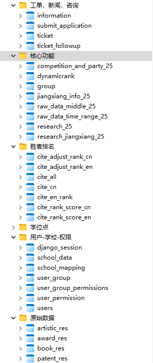

# 数据库文档

:::tip 小贴士

目前已可局域网访问。暂时无法在公网访问。

:::


## 一、数据库结构



- 原始数据：存放艺术，奖励，专著，专利等底层数据，与elasticsearch中的数据相同。
- 工单、新闻、咨询：管理用户工单、咨询申请和新闻信息，实现客户问题的跟踪处理和资讯发布功能。
- 胜者排名：本模块主要用于存放胜者排名，分为国际和国内，分析全球高校间的论文互引关系。
- 核心功能：主要用户沙盘推演，以及当前名次解析等
- 用户-学校-权限：主要用于用户认证、权限控制和学校基本数据存储。

:::details 各表中long_id的编写规范
  
  对于已有唯一号的，均予以保留。
  
  未统一编号的，所使用的long_id形如B24111903002492。
  
  - 第1位B（公办）本科/M民办本科/Z高职高专与职业大学，区分公办民办本科和职专（B有时会指公办民办本科，M不单列）。
  - 2-7位填上传日期。
  - 8-9位填上传时的领域，例如有10种不同竞赛，那么这两位可以依次填01-10，只要与本地文件保持一直即可。
  - 10-15位填递增序号。
:::
  

## 二、分模块介绍表结构

### 用户-学校-权限

:::tip 表间联系

1. `users`通过`groups_id`关联`user_group`
2. `user_group_permissions`作为中间表连接`user_group`和`user_permission`
3. `school_mapping`和`school_data`通过`school_data_id`和`school_mapping_id`相互关联
4. 通过`school_mapping`设置学校层面的权限和对比校

:::

#### 表结构说明

:::details users (用户表)

- `id`: 自增主键
- `user_id`: cookie记录的用户ID
- `username`: 登录用户名(唯一)
- `password`: SHA256哈希密码
- `sch_code`: 关联学校编码
- `created_at`: 创建时间
- `last_login`: 最后登录时间
- `email`: 邮箱
- `login_attempts`: 连续登录失败次数
- `account_locked_until`: 账户锁定截止时间
- `last_failed_attempt`: 最后失败登录时间
- `salt`: 静态salt
- `is_active`: 是否激活
- `is_anonymous`: 是否匿名用户(废弃)
- `is_authenticated`: 是否认证
- `is_superuser`: 是否为超级用户
- `is_staff`: 是否为管理员
- `groups_id`: 权限组ID
:::

:::details user_permission (权限表)

- `id`: 自增ID
- `api_url`: API接口URL
- `parameter`: 参数名称
- `data`: 参数值
- `method`: 发送方式
:::

:::details user_group_permissions (权限组-权限中间表)

- `id`: 自增ID
- `usergroup_id`: 权限组ID
- `userpermission_id`: 权限ID
:::

:::details user_group (用户权限组表)

- `id`: 自增ID
- `permission_group_name`: 权限组名称

:::

:::details school_mapping (学校权限表)

- `id`: 自增ID
- `sch_code`: 学科code
- `sch_name`: 学校名称
- `compare_sch_name`: 对比校
- `school_data_id`: 学校信息ID
- `can_view_all_compare`: 是否可查看所有对比学校
- `can_search_full`: 是否有全库查找权限
:::

:::details school_data (学校基本信息表)

- `rank`: 综合实力排名
- `sch_name`: 学校名称
- `province`: 省份
- `location`: 所在地
- `reference_type`: 学校参考类型
- `broad_categor`: 学校参考类
- `detailed_reference_type`: 学校细分参考型
- `reference_model`: 学校参考型
- `top_university`: 中国一流大学
- `is_double_first_class`: 双一流
- `city`: 城市
- `id`: 自增ID
- `school_mapping_id`: 学校权限表ID
- `sch_en_name`: 学校英文名
- `is_985`: 是否为985
- `is_211`: 是否为211
- `main_department`: 主管部门
- `sch_type_detail`: 学校类型
:::

:::details django_session (会话表)

- `session_key`: 会话键
- `session_data`: 会话数据
- `create_date`: 创建时间
- `expire_date`: 失效时间
- `user_id`: 用户ID
- `salt`: 动态salt
:::

### 原始数据

#### 表间联系

所有表通过`sch_name`(学校名称)字段关联

#### 表结构说明

:::details patent_res (专利表)

- `long_id`: 唯一号
- `full_name`: 中文题名
- `sch_name`: 最终校名
- `unit_number`: 单位总数
- `unit_order`: 单位顺序
- `patent_type`: 专利类型
- `writer`: 发明(设计)人
- `authorization`: 授权
- `transfer`: 转移
- `license`: 许可
- `year`: 授权年份
- `final_score`: 最终得分
- `basic_score`: 基础得分
- `id`: 自增ID
- `source_db`: 来源数据库
:::

:::details book_res (专著表)

- `id`: 自增ID
- `long_id`: 匹配编号
- `book_type`: 库别
- `full_name`: 著作名
- `writer`: 完成人
- `year`: 年份
- `sch_name`: 最终校名
- `publisher`: 出版社
- `final_score`: 最终得分
- `basic_score`: 基础得分
- `unit_number`: 完成单位总数
- `unit_order`: 完成单位顺序
- `total_citation_count`: 引用次数
- `source_db`: 数据库来源
:::

:::details award_res (奖项表)

- `id`: 自增ID
- `long_id`: 匹配编号
- `awardaffiliation`: 奖属
- `full_name`: 项目名称
- `writer`: 完成人
- `year`: 年份
- `sch_name`: 最终校名
- `category`: 获奖类别
- `award_level`: 获奖等级
- `final_score`: 最终得分
- `basic_score`: 基础得分
- `unit_number`: 完成单位总数
- `unit_order`: 完成单位顺序
- `org_name`: 学院
- `source_db`: 来源数据库
:::

:::details artistic_res (艺术作品表)

- `long_id`: 唯一ID
- `type`: 获奖类型
- `category`: 获奖来源类别
- `award_level`: 获奖等级
- `full_name`: 项目名称
- `unit_order`: 单位排名
- `unit_number`: 单位总数
- `final_score`: 最终得分
- `sch_name`: 学校名称
- `source_db`: 来源数据库
- `sch_type`: 学校类型
- `second_kind`: 专业类
- `writer`: 获奖人
- `award_type`: 艺术类型
- `id`: 自增ID
- `year`: 年份
:::

### 胜者排名

:::tip 表间联系

1. `cite_rank_score_en`和`cite_rank_score_cn`提供排名得分标准
2. `cite_en_rank`和`cite_cn`分别记录国际和国内高校引用数据
3. `cite_all`汇总全球高校对比结果
4. `cite_adjust_rank_en`和`cite_adjust_rank_cn`存储调整后的排名结果
:::

#### 表结构说明

:::details cite_rank_score_en (国际胜者排名得分表)

**说明**：每个排名对应得多少分

- `rank`: 胜者排名(主键)
- `rank_score`: 胜者排名分
- `cite_score`: 国际论文引用胜者归一得分
:::

:::details cite_rank_score_cn (国内胜者排名得分表)

**说明**：每个排名对应得多少分

- `rank`: 胜者排名(主键)
- `rank_score`: 胜者排名分
- `cite_score`: 国内论文引用胜者归一得分
:::

:::details cite_en_rank (国际高校引用排名表)

- `id`: 自增ID(主键)
- `sch_name`: 大学名称
- `cite_count`: 被引量
- `rank`: 排名
:::

:::details cite_cn (国内高校引用对比表)

说明：所有高校之间的论文引用胜者胜负情况

- `id`: ID(主键)
- `sch_name`: 学校名称
- `compare_sch`: 对比校
- `win`: 是否赢
- `lose`: 是否输
- `draw`: 是否平
- `empty`: 是否无引用
- `cite_scd`: 本校对对比校的scd引用量
- `cite_scdw`: 本校对对比校的scdw引用量
:::

:::details cite_all (全球高校引用对比汇总表)

- `id`: 自增ID(主键)
- `sch_name`: 学校名称
- `sch_country`: 学校所在国家
- `compare_country`: 对比大洲
- `sch_num`: 学校所在国家的数量
- `win`: 赢了多少学校
- `lose`: 输了多少学校
- `win_rate`: 赢的比例
- `draw`: 平局数
- `empty`: 胜负差值(win-lose)
- `diff`: 无引用情况
- `continent`: 大洲
:::

:::details cite_adjust_rank_en (国际调整后排名表)

- `id`: 自增ID(主键)
- `sch_name`: 校名
- `adjust_rate`: 引用量调整比例
- `adjust_rank`: 调整后SCDW胜者排名
:::

:::details cite_adjust_rank_cn (国内调整后排名表)

- `id`: 自增ID(主键)
- `sch_name`: 校名
- `adjust_rate`: 引用量调整比例
- `adjust_rank`: 调整后SCD胜者排名
:::

### 核心功能

:::tip 表间联系

1. `research_jiangxiang_25`和`research_25`存储核心科研成果数据
2. `raw_data_time_range_25`和`raw_data_middle_25`提供竞赛数据支持
3. `dynamicrank`表整合各类指标生成动态排名
4. `group`表管理用户自定义学校分组

:::


#### 表结构说明

**特别注意**:计算本科科研得分时，须使用调整过的最终概率作为probability_all_in_one。此处应当跟子谦确认。

:::details research_jiangxiang_25 (奖励数据表)

**说明**：存放奖项数据

- `long_id`: 唯一ID(主键)
- `date`: 年份
- `sch_name`: 学校名称
- `basic_score`: 基础分数
- `final_score`: 最终分数
- `probability_all_in_one`: 属于学科类的概率
- `from_db`: 数据库来源
- `type`: 类型
- `sch_type`: 学校类型
- `category`: 奖励类别
:::

:::details research_25 (综合科研成果表)

**说明**：存放除奖项外，其他如竞赛，论文，专著、艺术，思政、专利等基础数据

- `id`: 自增ID(主键)
- `long_id`: 唯一ID
- `date`: 年份
- `sch_name`: 学校名称
- `basic_score`: 基础得分
- `final_score`: 最终得分
- `probability_all_in_one`: 属于学科类的概率
- `from_db`: 数据来源
- `type`: 类型
- `sch_type`: 学校类型
:::

:::warning 注意
使用research_25表计算本科科研得分时，须使用调整过的最终概率作为probability_all_in_one。此处应当跟子谦确认。
:::

:::details raw_data_time_range_25 (本校排名数据库表)

说明：本张表用于网站的本校排名数据模块

- `id`: 自增ID(主键)
- `category`: 类别
- `name`:名称
- `sub_project`: 项目
- `max_date`: 最大时间
- `min_date`: 最小时间
- `update_time`: 更新时间
- `sch_type`: 学校类型
- `sch_type_detail`: 学校类型详情
:::

:::details raw_data_middle_25 (本校排名数据库总数表)

说明：本张表用于生成网站的本校排名数据模块的原始数据/总条数即（`total_SUM`字段），更加方便

- `id`: 自增ID(主键)
- `sch_name`: 学校名称
- `category`: 类别
- `name`: 名称
- `sub_project`: 项目名称
- `total_SUM`: 获奖总数
- `CURRENT_SUM`: 本次获奖数
- `LAST_SUM`: 上次获奖数
- `update_time`: 更新时间
- `sum_first_order`: 第一获奖单位次数
- `sch_type_detail`: 学校种类
:::

:::details jiangxiang_info_25 (奖项详情表)

- `long_id`: 唯一ID
- `项目名称`: 项目名称
- `获奖等级`: 获奖等级
- `完成单位总数`: 完成单位总数
- `完成单位顺序`: 完成单位顺序
:::

:::details group (学校分组表)

- `id`: 自增ID(主键)
- `school_mapping_id`: 学校权限表ID
- `group_school_id`: 学校组ID
- `selection_order`: 排名
- `user_id`: 用户ID
- `name`: 学校组名称
:::

:::details dynamicrank (动态排名表)

**说明**：当前名次模块数据均由本表提供

- `id`: 自增ID(主键)
- `sch_name`: 校名
- `StrengthRank`: 综合实力排名
- `Strength`: 综合实力得分
- `UndergraduateEmploymentQuality`: 本科生就业质量
- `UndergraduateEmploymentQualityRank`: 本科生就业质量排名
- `ScoreLine`: 录取分数线
- `ScoreLineRank`: 录取分数线排名
- `FacultyAcademicLevel`: 教师学术水平
- `FacultyAcademicLevelRank`: 教师学术水平排名
- `SelectionScore`: 择校顺序得分
- `SelectionScoreRank`: 择校顺序排名
- `PoliticalNormalization`: 党建思政得分
- `PoliticalNormalizationRank`: 党建思政排名
- `AdvancementRate`: 升学率
- `AdvancementRateRank`: 升学率排名
- `CompetitionNormalization`: 学生竞赛得分
- `CompetitionNormalizationRank`: 学生竞赛排名
- `CostEffectivenessNormalization`: 性价比得分
- `CostEffectivenessNormalizationRank`: 性价比排名
- `ScientificResearch`: 科学研究得分
- `ScientificResearchRank`: 科学研究排名
- `PaperCitationWinner`: 论文引用胜者得分
- `PaperCitationWinnerRank`: 论文引用胜者排名
- `year`: 年份
- `school_data_id`: 学校数据ID
- `UndergraduateTraining`: 本科生培养得分
- `UndergraduateTrainingRank`: 本科生培养排名
- `PostgraduateTraining`: 研究生培养得分
- `PostgraduateTrainingRank`: 研究生培养排名
- `NaturalScienceResearch`: 自然科学研究得分
- `NaturalScienceResearchRank`: 自然科学研究排名
- `SocialScienceResearch`: 社会科学研究得分
- `SocialScienceResearchRank`: 社会科学研究排名
:::

:::details competition_and_party_25 (竞赛与思政表)

**说明**：包含本科、民办、职专的所有党建、思政、各种学生竞赛数据。为保证入库时结构统一，已按照`【1125定稿】竞赛名与赛道组别对照表.xlsx`重新梳理了所有竞赛的名称

- `long_id`: 唯一ID(主键)
- `category`: 竞赛类别
- `competition_name`: 竞赛名称
- `project_name`: 项目名称
- `sub_project`: 竞赛具体信息
- `competition_level`: 获奖等级
- `sch_name`: 学校名称
- `score`: 得分
- `details`: 详细信息
- `end_year`: 获奖时间
- `sch_type`: 学校类型
:::

### 工单、新闻、咨询

#### 表间联系

1. `ticket`和`ticket_followup`通过`ticket_id`关联，形成工单与追问的1对多关系
2. 其他表之间没有直接外键关联，属于功能独立的模块

#### 表结构说明

:::details ticket_followup (工单追问表)

- `id`: 自增ID(主键)
- `description`: 问题描述
- `user_id`: 关联用户ID
- `created_at`: 创建时间
- `resolved_at`: 回复时间
- `update_at`: 修改时间
- `delete_at`: 删除时间
- `status`: 状态(默认'待处理')
- `resolution`: 回复内容
- `ticket_id`: 关联工单ID
- `attachment1`: 用户附件路径1
- `attachment2`: 用户附件路径2
- `admin_attachment1`: 客服附件1
- `admin_attachment2`: 客服附件2
- `ticketfollowup_id`: 追问工单ID(用于关联追问链)
:::

:::details ticket (工单主表)

- `id`: 自增ID(主键)
- `module`: 问题模块
- `description`: 问题描述
- `status`: 工单状态(默认'pending')
- `created_at`: 创建时间
- `resolved_at`: 回复时间
- `resolution`: 处理结果
- `user_id`: 用户ID
- `delete_at`: 删除时间
- `title`: 工单标题
- `kind`: 问题种类
- `phone`: 联系电话
- `is_read`: 是否已读
- `follow_ups`: 废弃字段(原追问工单ID)
- `ticket_id`: 工单编号
- `update_at`: 修改时间
- `attachment1`: 用户附件路径1
- `attachment2`: 用户附件路径2
- `admin_attachment1`: 客服附件1
- `admin_attachment2`: 客服附件2
:::

:::details submit_application (咨询申请表)

- `id`: 自增ID(主键)
- `institution`: 单位名称
- `phone`: 联系电话
- `email`: 电子邮箱
- `name`: 联系人姓名
- `message`: 咨询信息
- `create_time`: 创建时间
- `ip_address`: IP地址
:::

:::details information (新闻资讯表)

- `title`: 新闻标题
- `id`: 记录ID
- `url`: 新闻链接URL
:::
## 备份功能代码
用于创建副表和触发器，及时记录（即局部备份）每项改动。

:::details 代码实现
```python
import mysql.connector
from contextlib import closing
import re

# MySQL 连接参数
db_config = {
    'host': '192.168.0.91',
    'user': 'wu',
    'password': 'xZ7FwtAD5HnhajxJ',
    'database': 'wurank',
    'charset': 'utf8mb4'  # 设置字符集
}


# 获取表的列名
def get_columns(cursor, table_name):
    cursor.execute(f"SHOW COLUMNS FROM `{table_name}`")
    return [column[0] for column in cursor.fetchall()]

# 删除历史表（如果存在）
def drop_history_table_if_exists(cursor, conn, table_name):
    history_table = f"{table_name}_history"
    cursor.execute(f"SHOW TABLES LIKE '{history_table}'")
    if cursor.fetchone():
        print(f"History table {history_table} already exists. Dropping it.")
        cursor.execute(f"DROP TABLE IF EXISTS `{history_table}`")
        conn.commit()

# 创建历史表
def create_history_table(cursor, conn, table_name):
    columns = get_columns(cursor, table_name)
    history_table = f"{table_name}_history"
    columns_definition = ', '.join([f"`{col}` VARCHAR(255)" for col in columns])
    history_table_sql = f"""
    CREATE TABLE `{history_table}` (
        {columns_definition},
        `change_at` TIMESTAMP DEFAULT CURRENT_TIMESTAMP,
        `change_type` VARCHAR(10)
    ) CHARACTER SET utf8mb4;
    """
    cursor.execute(history_table_sql)
    conn.commit()
    print(f"History table {history_table} created.")

# 删除表上的所有触发器
def delete_triggers(cursor, conn, table_name):
    cursor.execute(f"SHOW TRIGGERS LIKE '{table_name}';")
    for trigger in cursor.fetchall():
        trigger_name = trigger[0]
        print(f"Deleting trigger: {trigger_name}")
        cursor.execute(f"DROP TRIGGER IF EXISTS `{trigger_name}`;")
    conn.commit()

# 创建触发器 SQL
def create_trigger_sql(table_name, columns, history_table, trigger_type):
    action = {'INSERT': 'NEW', 'UPDATE': 'NEW', 'DELETE': 'OLD'}[trigger_type]
    action_fields = ', '.join([f'{action}.`{col}`' for col in columns])
    
    history_columns = ', '.join([f"`{col}`" for col in columns] + ['change_at', 'change_type'])
    action_values = f"{action_fields}, NOW(), '{trigger_type}'"

    return f"""
    CREATE TRIGGER `{table_name}_{trigger_type.lower()}`
    BEFORE {trigger_type} ON `{table_name}`
    FOR EACH ROW
    BEGIN
        SET @trigger_status = (SELECT status FROM config_table WHERE config_item = '{table_name}_trigger');
        IF @trigger_status = 1 THEN
            INSERT INTO `{history_table}` ({history_columns})
            VALUES ({action_values});
        END IF;
    END;
    """

# 创建所有触发器
def create_triggers(cursor, conn, table_name):
    columns = get_columns(cursor, table_name)
    history_table = f"{table_name}_history"
    
    for trigger_type in ['INSERT', 'UPDATE', 'DELETE']:
        trigger_sql = create_trigger_sql(table_name, columns, history_table, trigger_type)
        cursor.execute(trigger_sql)
    conn.commit()

# 主函数
def update_triggers(table_name):
    try:
        with closing(mysql.connector.connect(**db_config)) as conn, closing(conn.cursor()) as cursor:
            cursor.execute("SET NAMES utf8mb4;")  # 设置会话字符集
            drop_history_table_if_exists(cursor, conn, table_name)
            create_history_table(cursor, conn, table_name)
            delete_triggers(cursor, conn, table_name)
            create_triggers(cursor, conn, table_name)
            print(f"触发器和历史表更新成功: {table_name} 表的触发器和历史表已更新！")
    except mysql.connector.Error as err:
        print(f"出现错误: {err}")

if __name__ == '__main__':
    table_names = ['sch_report_data_gbbk_gzgz']  # 将表名作为参数传入
    for table_name in table_names:
        update_triggers(table_name)
```
:::
