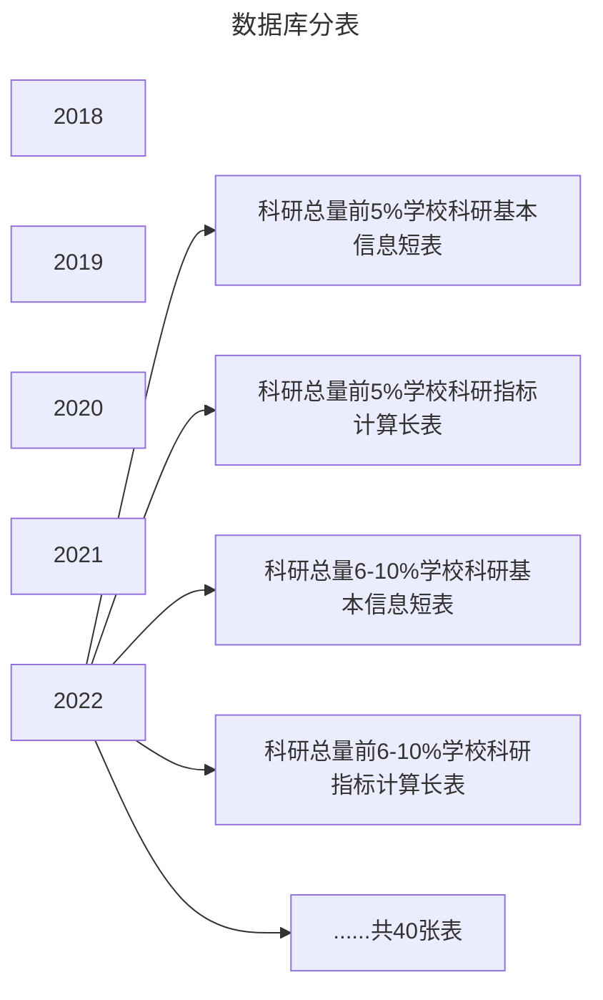

# 数据库分表规划

<MyViews></MyViews>

:::tip 小贴士

经过测试，如果想借助图形化界面处理数据，那么一次处理不超过20w条是比较合理的。再多就会导致超时、分配的内存用尽等等问题。20w数据处理的时间大约180s。

:::

## 分表

**科研数据分表**

**标准一：按常用/不常用字段分表**

计算科研总分和竞赛时，需要用到的字段仅有sch_name, probability_all_in_one, final_score三项。

因此，将其他论文基本信息、3项计算常用指标拆分。

**标准二：按年份、国内外成果拆分**

由于既往数据没有月份信息，因此将学校科研成果总量分成等和的2份，根据学校名单拆分，并且按年份拆分。5年成果共2000w（其中奖项计算跨度为10年）。平均每年不到400w。此后数据按月更新，因此按月、排名前50%拆分。确保每张表数据在20w左右。

**拆分结果**

