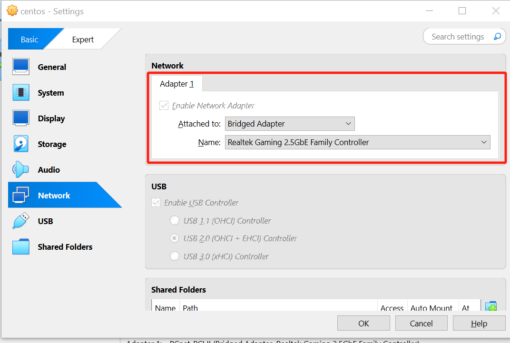
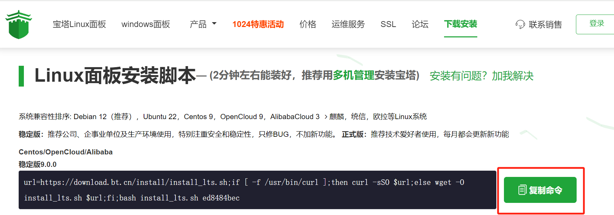

# Centos虚拟机搭建

<MyViews></MyViews>

:::tip 小贴士

目前已可局域网访问。暂时无法在公网访问。

:::

## 过程速览

1. 安装virtual Box，在阿里下载Centos的虚拟机并装载。
2. 无法直接联网，因此需要修改vitual Box设置和系统内配置文件<Badge text="重要"/>

3. 使用虚拟机内置的浏览器访问宝塔面板官网，用命令行下载平台。安装完毕后，应该可以在相同局域网的主机上直接登录后台。

:::提示

主机、虚拟机剪贴板不互通。联网完成后，建议使用qq邮箱进行主机和虚拟机的信息传递。

:::

## 装载虚拟机

下载vitualBox，过程略。

在[阿里官方镜像](https://mirrors.aliyun.com/centos/?spm=a2c6h.13651104.d-2001.1.140f320cfhreMl)下载centos。选择需要的版本，之后点击选择ISOS目录，下载对应版本的ISO文件。目前下载的是DVD版本（4G大小）。下载完毕后把ISO拖到virtualbox就能安装。需要注意的是，在虚拟机端安装应选择带桌面的版本，不要纯命令行版本。


## 配置网络设置
1. 打开终端，进入指定目录

```cmd
# 虚拟机终端
cd /etc/sysconfig/network-scripts/
ls
```

2. ls查看一下当前目录文件，应该有一个类似`ifcfg-eth0` 的文件。`eth0`的部分不同无所谓，根据本机文件名输入即可。

```cmd
# 虚拟机终端
sudo vi  ifcfg-eth0
```

3. 由于文件必须由管理员修改，因此只能用命令行操作，不能使用图形化界面。

:::tip vim编辑器操作方法
进入后按`i`键进行intert模式（会有显示），之后就可以任意编辑了。
编辑完成后先按`esc`退出编辑模式，再输入`:wq`保存退出。
如果输入错了，按`:!q`不保存退出。未修改的文档可以输入`:q`直接退出。
:::

`ifcfg-eth0`文件内容改为下面这样。

```cmd
# ifcfg-eth0文件

TYPE=Ethernet
PROXY_METHOD=none
BROWSER_ONLY=no
BOOTPROTO=static
IPADDR=192.168.0.91
NETMASK=255.255.255.0
GATEWAY=192.168.0.1
DNS1=8.8.8.8
DNS2=8.8.4.4
DEFROUTE=yes
IPV4_FAILURE_FATAL=no
IPV6INIT=yes
IPV6_AUTOCONF=yes
IPV6_DEFROUTE=yes
IPV6_FAILURE_FATAL=no
IPV6_ADDR_GEN_MODE=stable-privacy
NAME=enp0s3
UUID=6df11ffa-518e-47cd-93bb-f4e6145a7440
DEVICE=enp0s3
ONBOOT=yes
NM_CONTROLLED=yes
```

4.完成后，再配置vitual box设置，默认的是NAT，这里要改为桥连模式，否则IP不固定，局域网会无法直接连接。适配器选择和主机一样的适配器型号。



更改设置后，需要重启网络。之后如果能正常上网就ok了。
```cmd
sudo systemctl network restart
```

## 安装宝塔

1. 在虚拟机中，使用火狐浏览器直接搜索宝塔面板

2. 在官网的安装页面，有复制命令按钮，直接复制到终端运行即可。



3. 安装完毕后，把分配的账号、密码、内外网链接（由于是虚拟机，应该只有内网有效）等等复制下来保存好。可以在桌面建个文本文档存储下来，并用QQ邮箱发送给主机。
4. 之后，应当可以在连接局域网的任意主机上用内网链接去访问后台了。后续直接在后台操作即可。
